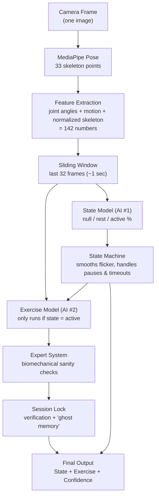

# How the Virtual Gym Coach Works (Module 1)

*A plain-English walkthrough of the pipeline — for the supervisor meeting.*

---

## 1. The one-sentence version

We point a camera at someone exercising. The system watches their **skeleton** (not the actual video pixels), figures out whether they're **exercising or resting**, and if they're exercising, figures out **which exercise** it is (squat, bicep curl, shoulder press, or deadlift) — updating this decision roughly 30 times a second, live.

There are two run modes, both using the exact same pipeline underneath:
- **`app.py`** — a desktop demo: webcam or a video file opens in an OpenCV window with the skeleton and labels drawn on it.
- **`api.py` + `frontend/`** — a web app: browser sends frames over a WebSocket to a FastAPI server, which runs the same pipeline and streams results back to a live dashboard.

---

## 2. The big picture



Two separate AI "brains" are used instead of one:
1. **State brain** — a simpler question: *is this person doing anything right now?*
2. **Exercise brain** — only wakes up once the state brain says "active", then asks: *which of our 4 exercises is this?*

Splitting the problem this way is much easier to get right than asking one model to do everything at once, and it lets us apply very different rules to each stage (see below).

---

## 3. Step by step

### Step 1 — Pose extraction (`src/pose_extractor.py`)
We never feed raw pixels into our own models. Google's **MediaPipe Pose** library looks at each camera frame and returns **33 body landmarks** (nose, shoulders, elbows, wrists, hips, knees, ankles, etc.), each with an `(x, y, z, visibility)` value. This is the "skeleton".

> Example: for one frame, landmark #15 (left wrist) might come back as `{x: 0.42, y: 0.61, z: -0.03, visibility: 0.98}` — meaning MediaPipe is 98% sure it found the left wrist, roughly in the lower-middle of the frame.

### Step 2 — Feature extraction (`src/features.py`)
Raw landmark coordinates depend on how close the person is to the camera and where they're standing — not useful on their own. So we compute:
- **Normalized skeleton** — re-centered on the hips and scaled by torso length, so it doesn't matter if the person is near or far from the camera, or standing left vs. right of frame.
- **9 joint angles** — knees, hips, shoulders, elbows, and trunk lean, in degrees (e.g. a knee angle of ~170° = standing straight, ~90° = deep squat).
- **Motion energy** — one number representing "how much did every joint move since the last frame" (near 0 = standing still, high = fast movement).

All of this is packed into **142 numbers per frame** (132 for the skeleton + 9 angles + 1 motion energy value).

### Step 3 — Sliding window (32 frames)
A single frame can't tell you "this is a squat" — a squat is a *movement over time*. So instead of judging one frame, we keep a rolling buffer of the **last 32 frames** (~1 second of video at 30 fps) and feed the whole sequence into the AI models. As each new frame arrives, the oldest one drops off the back — like a conveyor belt.

### Step 4 — State Model — AI #1 (`src/state_rules.py`)
A **BiLSTM neural network** (a type of model good at understanding sequences) looks at the 32-frame window and outputs three probabilities that add up to 100%:

```
Example raw output:  Null: 5%   Rest: 12%   Active: 83%   →  looks like "active"
```

### Step 5 — The State Machine (`src/state_machine.py`)
Raw AI output flickers frame to frame (e.g. it might briefly say "Rest: 55%" for one frame while someone pauses at the bottom of a squat to breathe). We don't want the whole workout set to look like it "ended" because of one shaky frame, so a simple set of rules smooths this out:

- If a **session is open** (user was just active) and the AI suddenly says "not active," we don't panic immediately — the state keeps showing **`active`** for a **2-second grace period** first.
- If it's *still* not active after 2 seconds, we switch to **`rest`** (the set is over, but we're still watching in case they start again).
- If **60 seconds** pass with no new activity, we give up and close the session — state goes to **`null`**.

```
Example timeline:
0:00  squatting              → ACTIVE
0:12  stops moving (pause)   → still ACTIVE (grace period)
0:14  still not moving       → REST   (set officially over)
1:14  still no movement      → NULL   (session closed, 60s timeout hit)
```

### Step 6 — Exercise Model — AI #2 (`src/exercise_rules.py`)
This only runs when the state is `active`. A second BiLSTM (same 32-frame window) scores all 4 supported exercises:

```
Example raw output:  Squat: 78%   Bicep Curl: 4%   Shoulder Press: 3%   Deadlift: 15%
```

### Step 7 — The "Expert System" (physics sanity checks)
Neural networks can be confidently wrong on movements they've never seen (e.g. scratching your ear looking a bit like a bicep curl). So before trusting the AI's score, we run simple **biomechanics checks** using real physics measurements from the skeleton:

| Rule | Logic | Blocks |
|---|---|---|
| Leg check | Legs barely moved AND hips didn't drop | Squat, Deadlift |
| Lower-body lock | Legs moved a lot AND hips dropped a lot | Bicep Curl, Shoulder Press |
| Wrist height (low) | Wrists never went above shoulder height | Shoulder Press |
| Wrist height (high) | Wrists went well above the head | Bicep Curl |

If a rule fires, that exercise's score is forced to **0%** — no matter how confident the neural network was.

### Step 8 — Session lock, verification & "ghost memory"
To avoid the exercise label flickering between similar-looking movements every frame, we don't trust a single prediction instantly:

- **Verification**: an exercise must be the top prediction for **15 consecutive frames (0.5 sec)** before we "lock it in" for the set. While this is happening, the UI shows `VERIFYING...`.
- **Session lock**: once locked, that exercise stays locked for the rest of the set — the system won't second-guess itself mid-set (unless the physics rules above prove the lock is now physically impossible).
- **Ghost memory**: when a set ends, we remember the last locked exercise for **30 seconds** into the rest period. If a *different* exercise looks like it's starting, we require a much longer confirmation — **3 seconds (90 frames)** instead of 0.5s — so a stray arm movement during rest doesn't accidentally start a new exercise.

### Step 9 — Output
Every processed frame produces one small result:
```json
{
  "state": "active",
  "exercise": "squat",
  "confidence": 91.4,
  "elapsed_active_sec": 12.3,
  "state_probs": {"null": 0.01, "rest": 0.06, "active": 0.93}
}
```
In the desktop demo (`app.py`) this is drawn directly on the OpenCV video window. In the web app, this same JSON is pushed over a WebSocket to the browser dashboard in real time (state, exercise, confidence, elapsed time, raw probabilities, etc. — see `frontend/`).

---

## 4. Worked examples — covering the main scenarios

### 4.1 The full mini-set: squat → pause → bicep curl

Say someone does 3 squats, pauses to catch their breath, then starts bicep curls:

| Time | What's happening physically | State AI says | State Machine output | Exercise AI + rules | Final label shown |
|---|---|---|---|---|---|
| 0:00 | Standing still | Null 90% | `null` | (not running) | — |
| 0:01 | Starts squatting | Active 88% | `active` | Squat 60% (still verifying) | `VERIFYING...` |
| 0:01.5 | Still squatting | Active 95% | `active` | Squat 92%, 15 frames confirmed | **`squat`** (locked) |
| 0:08 | Finishes 3rd squat, pauses | Rest 70% | `active` *(2s grace)* | still locked | `squat` |
| 0:10 | Still paused | Rest 85% | `rest` | locked exercise kept ("ghost") | `squat` *(elapsed frozen)* |
| 0:15 | Starts bicep curls | Active 80% | `active` | Bicep Curl rising, needs 90 frames (3s) since it differs from the ghost | `VERIFYING...` |
| 0:18 | Clearly curling | Active 97% | `active` | Bicep Curl 94%, confirmed | **`bicep_curl`** (new lock) |

This is exactly the kind of behaviour the state machine + ghost memory logic in Steps 5 and 8 was built to produce — a set of squats doesn't get corrupted by a mid-set breather, and a new exercise doesn't get triggered by a stray movement, but a genuinely new exercise still gets picked up within a few seconds.

### 4.2 Nobody in the frame

The camera is on, but the room is empty (or the person steps fully out of shot):

| Time | What's happening | Pose extraction | Feature vector | State AI says | Final state |
|---|---|---|---|---|---|
| 0:00 | Empty room | MediaPipe finds no landmarks → `None` | All-zero 142-dim vector (no skeleton to measure) | Null 99% | `null` |

This is exactly the shape of input the state model was trained on for the "null" class (`training/auto_process_null.py` processed empty-room clips the same way), so it recognises it confidently. No exercise check ever runs, because it only runs when state is `active`.

### 4.3 Ambiguous movement — not confident enough to lock in

Someone does a slow, unusual movement that isn't clearly one of the 4 exercises (say, a light torso twist) — legs move a little but not enough to trip the leg-based rules, wrists stay mid-height:

| Check | Result |
|---|---|
| Leg check (Rule 1) | Doesn't fire — legs moved a bit |
| Lower-body lock (Rule 2) | Doesn't fire — not massive leg movement |
| Wrist height (Rule 3) | Doesn't fire — wrists stayed mid-height |
| Raw AI scores | Squat 30%, Bicep Curl 28%, Shoulder Press 24%, Deadlift 18% (no clear winner) |

Since no physics rule fired *and* the top score (30%) is below the **50% confidence** needed to start a lock, the system reports `exercise: None` with reason `WAITING FOR HIGH CONFIDENCE` — state stays `active`, but no exercise label is shown until the movement becomes clearer.

### 4.4 Physics rules correct a wrong AI guess

Someone is doing bicep curls, standing still. The neural network briefly misreads the arm motion and scores **Squat 55%** (its highest score) — but the skeleton math tells a different story:

| Measurement | Value | Rule triggered |
|---|---|---|
| Leg energy | 0.04 (almost no leg movement) | below 0.15 threshold |
| Hip drop | 0.006 (hips barely moved) | below 0.015 threshold |
| → Rule 1 fires | **Squat and Deadlift forced to 0%**, regardless of the network's 55% guess |

With Squat removed, the system re-ranks what's left — **Bicep Curl 90%** vs **Shoulder Press 10%** — and correctly locks in `bicep_curl`. This is the entire point of Step 7: the network's confidence never overrides basic physics.

### 4.5 A locked exercise resists a momentary flicker

Someone is mid-squat-set, already locked to `squat`. For one 32-frame window they scratch their nose, and the network's raw score briefly spikes for Bicep Curl:

| | Squat (locked) | Bicep Curl (network's momentary top pick) |
|---|---|---|
| Raw AI score this window | 41% | 52% |
| Physics rules | Legs + hips still show clear squat motion over the window → Rule 1 does **not** block Squat | — |
| Session lock check | `squat` is already locked and its probability isn't `0%` → **lock is kept** | ignored |

Because `squat` was already locked in this set and the physics rules didn't zero it out, the system doesn't even consider switching — output stays `squat`. Locks only break if a physics rule proves the *locked* exercise is now impossible (e.g. they actually stop moving their legs entirely).

### 4.6 A short pause never even reaches "rest"

Same set, but this time the pause between reps is brief — under 2 seconds:

| Time | What's happening | State AI says | State Machine output |
|---|---|---|---|
| 0:05 | Mid-squat pause to reset stance | Rest 60% | `active` *(1.3s into the 2s grace period)* |
| 0:06.2 | Starts next rep again | Active 90% | `active` (grace timer reset) |

Because the pause never lasted the full 2-second grace period, the state machine never even displayed `rest` — the set reads as one continuous `active` block the whole time, and the locked exercise and elapsed timer are untouched.

### 4.7 Long rest: ghost memory expires, then a new exercise locks in *fast*

Someone finishes a squat set, then rests for a long time (**over 30 seconds**, but under the 60s session timeout) before starting shoulder presses:

| Time | Event | Ghost memory | Verification needed for a new exercise |
|---|---|---|---|
| 0:00 | Squat set ends → `rest` | Ghost = `squat`, counting up | — |
| 0:31 | 900+ frames of rest have passed | **Ghost cleared** (`None`) | — |
| 0:45 | Starts shoulder presses | No ghost to compare against | Falls back to the normal **15-frame / 0.5s** lock, not the slower 90-frame check |
| 0:45.5 | Confirmed | — | **`shoulder_press`** locked quickly |

The 3-second "skeptical" check in Step 8 only applies while a ghost memory is still active (within 30s of the last set). Once it expires, a genuinely new exercise is picked up just as fast as the very first exercise of a session.

### 4.8 Walking away — the full session timeout

Someone finishes their workout and leaves the frame entirely, with no more movement at all:

| Time | Event | Final state |
|---|---|---|
| 0:00 | Last rep finishes, person stands still | `active` *(2s grace)* |
| 0:02 | Grace period over | `rest` |
| 0:32 | 30s of stillness → ghost memory of the last exercise clears | `rest` (exercise now shown as `None`) |
| 1:02 | Full 60s timeout reached since leaving `active` | `null` — **session closed** |

Two independent timers are at play here: the **30-second ghost memory** (how long we still *remember* the last exercise during rest) and the **60-second session timeout** (how long we keep the session "open" at all before resetting to `null`). Resting longer than 30s but less than 60s, as in Scenario 4.7, is exactly what lets a *new* exercise re-lock quickly instead of waiting for the full close-out.

---

## 5. Anticipated questions

**Q: If the physics rules can identify the exercise, why do you need a neural network at all?**

Short answer: the physics rules can only rule things *out* — they can't pick the right answer *in*. They're a filter, not a classifier.

1. **The rules only cover the extremes, not the middle.** Rule 1 fires when leg energy is `< 0.15` (almost no movement); Rule 2 fires when it's `> 0.8` (massive movement). Everything in between — which is most real reps — triggers no rule at all. You need something that actually scores and ranks the 4 exercises across that whole middle range. That's the neural network's job.
2. **Rules can't tell squat from deadlift, or bicep curl from shoulder press, in the cases where both remain "physically possible."** E.g. Rule 1 blocks *both* Squat and Deadlift together when legs are still — it can't distinguish between the two once legs *are* moving, because that distinction is about subtle things like hip-hinge angle over time and torso lean pattern — exactly the kind of nuanced, sequential pattern a BiLSTM learns from labeled examples, not something you can hand-write as a clean threshold.
3. **Hand-written rules don't scale or generalize.** Covering every camera angle, body type, and speed variation with pure if/else logic would mean hundreds of brittle special cases, and it would still break the moment someone does the exercise slightly differently than anticipated. A neural network trained on real video data generalizes across that variation automatically, because it learned the pattern statistically instead of being told the pattern.
4. **The network gives a confidence-ranked answer; rules just give a yes/no per exercise.** You still need something to say "of the exercises that are still possible, which one is it, and how sure are we?" — that ranking and scoring is what the softmax output does.

**The analogy that lands well:** the neural network is the *expert* — it's seen thousands of examples and does the actual pattern recognition. The physics rules are the *sanity check* — a clipboard that says "wait, this can't be a squat, the hips never dropped," no matter how confident the expert sounds. You need the expert to do the real classification job; you need the sanity check because experts (neural networks) can be confidently wrong on things they've never seen before, and a plain softmax score can't tell the difference between "I'm sure" and "I'm sure but this is nonsense."

So it's not rules *instead of* a model, or a model *instead of* rules — it's the model doing the hard classification work, with a small, interpretable rule layer catching the specific failure mode neural networks are known for (confident nonsense on out-of-distribution input).

---

## 6. Why two AI models instead of one?

- **Simpler questions are more accurate.** "Is this person moving?" is a much easier question than "is this person moving *and* which of 4 exercises is it?" combined.
- **Different rules apply.** The exercise model needs the expert-system physics checks and session-lock logic; the state model doesn't.
- **Efficiency.** The exercise model (the more expensive check) only runs when the state model says `active` — no point scoring "which exercise" while someone is just standing there.

---

## 7. Model results (from evaluation on held-out test videos)

- **State model:** ~99% macro-average accuracy across null / rest / active.
- **Exercise model:** precision of 1.00 for squat & deadlift (no false positives), recall of 1.00 for the upper-body exercises (no missed detections), ROC-AUC ≈ 1.00 for all 4 classes on the test set.

(See `outputs/*.png` for the confusion matrices and ROC curves generated during evaluation.)

---

## 8. Where to look in the code

| Concept | File |
|---|---|
| Camera → skeleton | `src/pose_extractor.py` |
| Skeleton → features (angles, motion, normalization) | `src/features.py` |
| State AI (null/rest/active) | `src/state_rules.py` |
| Smoothing / timeout rules | `src/state_machine.py` |
| Exercise AI + physics expert system + session lock | `src/exercise_rules.py` |
| Desktop demo entry point | `app.py` |
| Web server (FastAPI + WebSocket) | `api.py`, `src/session.py` |
| Live dashboard | `frontend/` |
| Tunable numbers (window size, timeouts, thresholds) | `config.py` |
